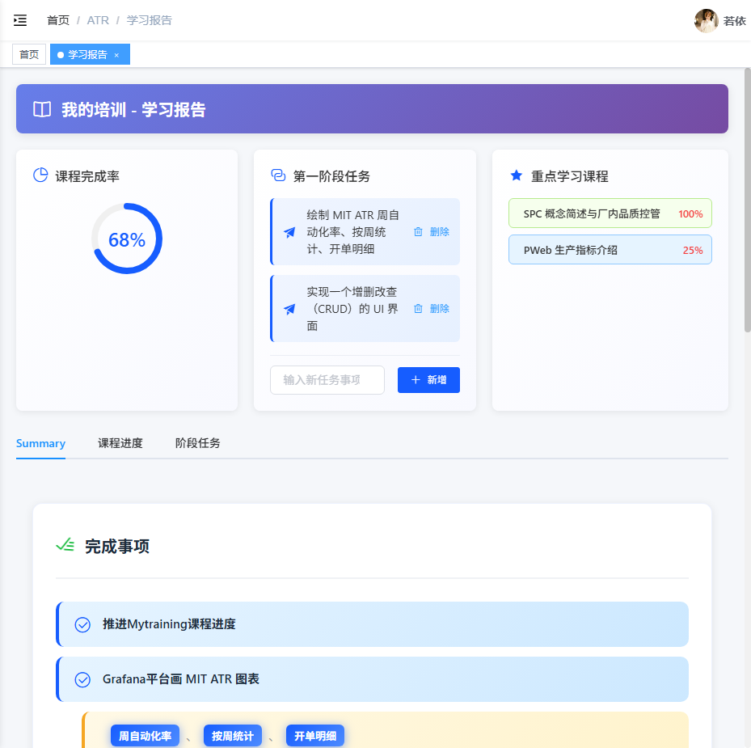
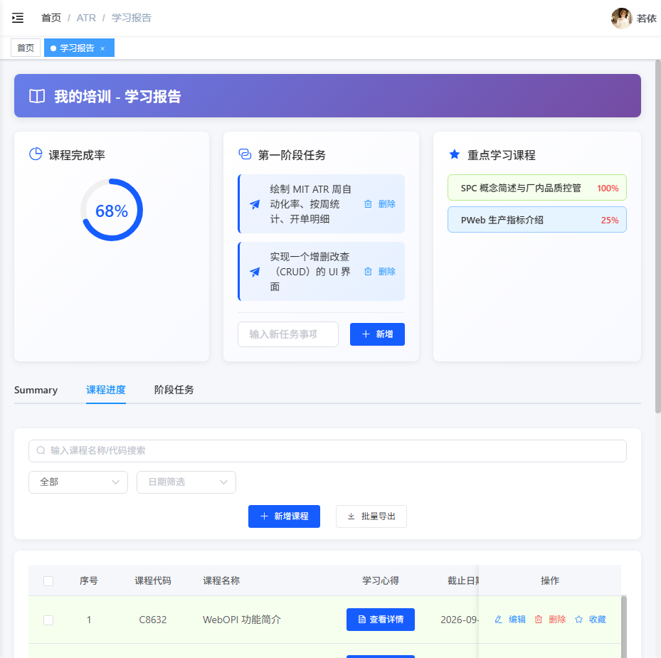
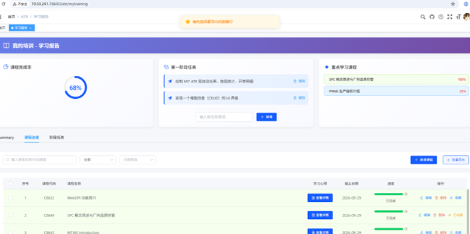

# 测试报告：TC-COURSE-018 批量导出 - 未选择数据（第二轮测试）

## 📈 测试结果

| 测试项 | 状态 |
|--------|------|
| **TC-COURSE-018** | ✅ **通过** |

## 📝 测试小结

### 测试概况
- **测试用例 ID**: TC-COURSE-018
- **测试用例名称**: 批量导出 - 未选择数据
- **测试场景**: 验证批量导出功能在未选择任何数据时的校验逻辑
- **测试时间**: 2026-05-21 13:44
- **测试人员**: 测试执行工程师
- **测试环境**:
  - OS: Windows 10
  - 浏览器：Chrome (Playwright)
  - 设备：Desktop
  - 网络：局域网

### 测试目的
验证批量导出功能在未选择任何数据时是否正确进行校验，提示用户先选择数据。

### 第一轮测试结果（Bug）
- **状态**: ❌ 失败
- **问题**: 系统显示提示"已导出文件：2026 年 05 月 19 日培训学习报告.xlsx"，文件被下载到本地，没有进行任何选中数据的校验

### 第二轮测试结果（验证修复）
- **状态**: ✅ 通过
- **实际结果**: 系统正确显示提示"请先选择要导出的数据行"，未执行导出操作

---

## 1. 测试步骤执行详情

### 步骤 1: 访问我的培训页面
- **操作**: 导航到 http://10.50.241.156:83/atr/mytraining
- **预期**: 页面正常加载
- **实际**: ✅ 页面正常加载（需要登录）
- **证据**:
  - 

### 步骤 2: 点击"课程进度"标签页
- **操作**: 点击课程进度标签
- **预期**: 切换到课程进度面板
- **实际**: ✅ 成功切换到课程进度面板
- **证据**:
  - 

### 步骤 3: 确保没有勾选任何课程记录并截图
- **操作**: 确认表格中所有复选框均未勾选
- **预期**: 所有复选框处于未选中状态
- **实际**: ✅ 所有复选框均未勾选
- **证据**: 
  - 

### 步骤 4: 点击"批量导出"按钮
- **操作**: 点击批量导出按钮
- **预期**: 系统提示用户先选择要导出的数据
- **实际**: ✅ 系统显示提示"请先选择要导出的数据行"
- **证据**: 
  - 

---

## 2. 系统响应验证

### 提示信息
```
请先选择要导出的数据行
```

### 期望行为对比
| 检查项 | 期望结果 | 实际结果 | 状态 |
|--------|----------|----------|------|
| 显示提示信息 | 是 | 是 | ✅ |
| 提示内容正确 | "请先选择要导出的数据行" | "请先选择要导出的数据行" | ✅ |
| 不执行导出操作 | 是 | 是 | ✅ |
| 不下载文件 | 是 | 是 | ✅ |

---

## 3. 网络请求分析

点击批量导出按钮后，**没有**触发任何导出相关的 API 请求，说明前端校验成功拦截了无效操作。

网络请求列表（测试期间）：
```
[GET] http://10.50.241.156:83/atr/mytraining => [200] OK
[GET] http://10.50.241.156:83/static/js/chunk-vendors.js => [200] OK
[GET] http://10.50.241.156:83/static/js/app.js => [200] OK
[POST] http://10.50.241.156:83/dev-api/login => [200] OK
[GET] http://10.50.241.156:83/dev-api/getInfo => [200] OK
[GET] http://10.50.241.156:83/dev-api/getRouters => [200] OK
```

---

## 4. 控制台日志

```
[LOG] [HMR] Waiting for update signal from WDS...
[INFO] Download the Vue Devtools extension for a better development experience
[INFO] Slow network is detected.
[WARNING] [vue-router] Non-nested routes must include a leading slash character.
[WARNING] Can't get DOM width or height. Please check dom.clientWidth and dom.clientHeight.
```

无错误日志，系统运行正常。

---

## 5. Bug 修复验证结论

### 原 Bug 描述
- **Bug ID**: BUG-COURSE-018
- **严重程度**: P2（一般）
- **问题描述**: 批量导出功能在未选择任何数据时，没有进行校验，直接执行导出操作并下载文件

### 修复验证
| 验证项 | 第一轮 | 第二轮 | 状态 |
|--------|--------|--------|------|
| 显示校验提示 | ❌ 无提示 | ✅ 显示"请先选择要导出的数据行" | 已修复 |
| 阻止导出操作 | ❌ 执行导出 | ✅ 阻止导出 | 已修复 |
| 文件下载 | ❌ 下载文件 | ✅ 无下载 | 已修复 |

### 结论
✅ **Bug 已修复** - 批量导出功能现在正确实现了前端校验逻辑，在未选择数据时会提示用户先选择要导出的数据行。

---

## 6. 附件

### 测试证据
- [docs-test-test-report-mytraining-TC-COURSE-018-第二轮-step1-screenshot-登录页面.png](docs-test-test-report-mytraining-TC-COURSE-018-第二轮-step1-screenshot-登录页面.png) - 登录页面截图
- [docs-test-test-report-mytraining-TC-COURSE-018-第二轮-step2-screenshot-课程进度页.png](docs-test-test-report-mytraining-TC-COURSE-018-第二轮-step2-screenshot-课程进度页.png) - 课程进度页面截图
- [docs-test-test-report-mytraining-TC-COURSE-018-第二轮-step3-screenshot-课程进度页无勾选.png](docs-test-test-report-mytraining-TC-COURSE-018-第二轮-step3-screenshot-课程进度页无勾选.png) - 课程进度页面截图，确认无勾选任何记录
- [docs-test-test-report-mytraining-TC-COURSE-018-第二轮-step4-screenshot-显示校验提示.png](docs-test-test-report-mytraining-TC-COURSE-018-第二轮-step4-screenshot-显示校验提示.png) - 点击批量导出后显示校验提示的截图

---

**报告生成时间**: 2026-05-21 13:44
**测试工程师**: 测试执行工程师
