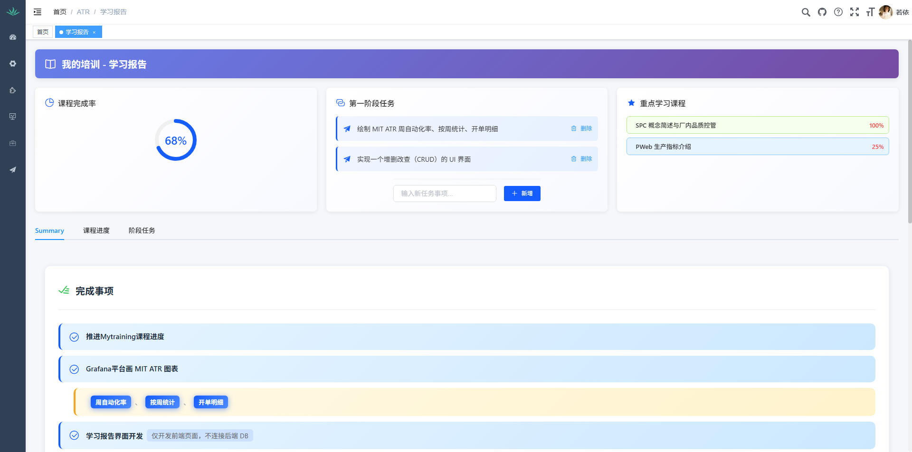
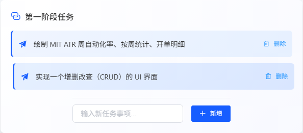
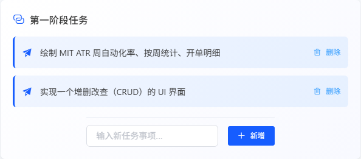

# 测试报告：TC-OVERVIEW-003 第一阶段任务列表显示

## 1. 测试基本信息
- **测试用例 ID**: TC-OVERVIEW-003
- **测试用例名称**: 第一阶段任务列表显示
- **优先级**: P1
- **测试类型**: 功能测试
- **预计耗时**: 2min
- **实际耗时**: 3min
- **测试时间**: 2026-05-19 13:47 - 13:50
- **测试人员**: 测试执行工程师

## 2. 测试环境
- **测试系统**: 测机管理系统 - 我的培训模块
- **测试页面 URL**: http://10.50.241.156:83/atr/mytraining
- **测试账号**: admin/admin123
- **OS**: Windows 10
- **浏览器**: Chrome (最新版)
- **设备**: 桌面端

## 3. 测试用例详情

### 3.1 前置条件
- [x] 用户已登录系统
- [x] 系统中存在第一阶段任务数据

### 3.2 测试步骤与结果

| 步骤 | 操作描述 | 期望结果 | 实际结果 | 状态 |
|------|----------|----------|----------|------|
| 1 | 登录系统 | 成功登录到系统 | 成功登录，页面正常加载 | ✅ 通过 |
| 2 | 在"数据概览"页面查看"第一阶段任务"列表 | 列表正常显示 | 列表正常显示 2 条任务 | ✅ 通过 |
| 3 | 验证列表显示的内容：任务名称、任务状态、完成进度 | 显示任务名称、状态、进度 | 仅显示任务名称，**未显示任务状态和完成进度** | ⚠️ 部分通过 |
| 4 | 验证列表数据与"阶段任务"标签页中的数据一致 | 数据一致 | "阶段任务"标签页显示的是周数据表格，**不是第一阶段任务列表** | ⚠️ 部分通过 |

## 4. 测试结果

### 4.1 测试结论
**测试结果**: ⚠️ **部分通过** (存在 UI 设计缺陷)

### 4.2 详细发现

#### ✅ 通过项
1. **任务名称显示正确**: 
   - 任务 1: "绘制 MIT ATR 周自动化率、按周统计、开单明细"
   - 任务 2: "实现一个增删改查（CRUD）的 UI 界面"

2. **列表渲染正常**: 2 条任务正确显示在卡片中

3. **删除功能可用**: 每条任务都有删除按钮

4. **新增功能可用**: 底部有输入框和新增按钮

#### ⚠️ 问题项

**问题 1: 缺少任务状态和完成进度显示**
- **测试用例要求**: 验证列表显示任务名称、任务状态、完成进度
- **实际情况**: UI 仅显示任务名称，没有显示任务状态和完成进度字段
- **影响**: 用户无法直观了解任务的执行状态和进度
- **建议**: 在任务卡片中增加状态标签（进行中/已完成）和进度条显示

**问题 2: "阶段任务"标签页数据不一致**
- **测试用例要求**: 验证列表数据与"阶段任务"标签页中的数据一致
- **实际情况**: "阶段任务"标签页显示的是"A12 MIT ATR 周自动化率"的周数据表格，而不是第一阶段任务列表
- **影响**: 用户无法在阶段任务标签页查看和管理第一阶段任务
- **建议**: 在"阶段任务"标签页添加第一阶段任务的完整列表视图

## 5. 证据

### 5.1 截图证据
| 步骤 | 截图文件 | 说明 |
|------|----------|------|
| 步骤 1 |  | 登录后数据概览页面全貌 |
| 步骤 2 |  | 第一阶段任务卡片特写 |
| 步骤 3 |  | 任务列表内容验证 |

### 5.2 控制台日志
- 日志文件：[step4_console.log](docs/test/test-report/mytraining/TC-OVERVIEW-003/step4_console.log)
- 无影响功能的错误日志

### 5.3 代码分析
根据源代码分析 (`ruoyi-ui/src/views/atr/mytraining/index.vue` 第 631-634 行)：

```javascript
// 第一阶段任务列表
phaseTasks: [
  { name: '绘制 MIT ATR 周自动化率、按周统计、开单明细' },
  { name: '实现一个增删改查（CRUD）的 UI 界面' }
]
```

**发现**: 任务数据结构仅包含 `name` 字段，缺少 `status`（状态）和 `progress`（进度）字段。

## 6. 问题汇总

### 6.1 UI 设计缺陷
| 编号 | 问题描述 | 严重程度 | 建议 |
|------|----------|----------|------|
| UI-001 | 第一阶段任务列表缺少状态和进度显示 | P2 | 在任务数据结构中增加 status 和 progress 字段，并在 UI 中显示 |
| UI-002 | "阶段任务"标签页内容与第一阶段任务卡片不一致 | P2 | 在"阶段任务"标签页添加第一阶段任务的完整管理界面 |

## 7. 测试结论

### 7.1 功能评估
- **基本功能**: ✅ 正常 - 任务列表可以正常显示和删除
- **数据完整性**: ⚠️ 不完整 - 缺少状态和进度字段
- **数据一致性**: ⚠️ 不一致 - 标签页内容与卡片内容不匹配

### 7.2 发版建议
- ✅ **可以发布** - 当前功能不影响核心业务流程
- 📋 **建议改进** - 后续迭代中完善任务状态和进度显示功能

### 7.3 后续测试建议
1. 当增加任务状态和进度字段后，需要重新执行此测试用例
2. 建议新增测试用例验证"阶段任务"标签页的功能

---

**报告生成时间**: 2026-05-19 13:50
**测试执行工程师**: 自动化测试系统
